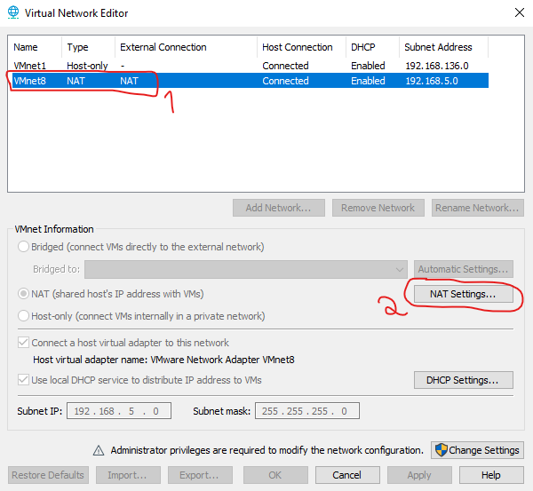
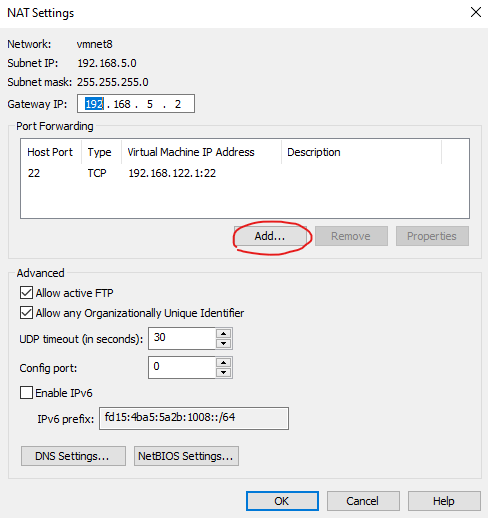
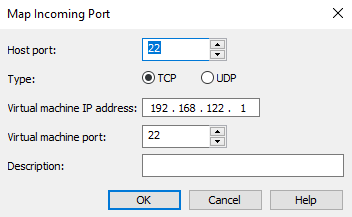
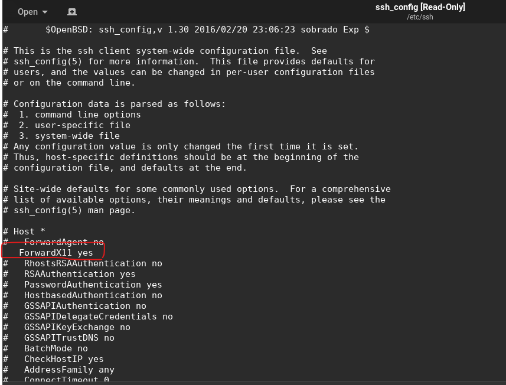
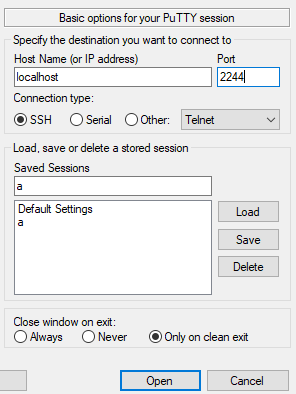
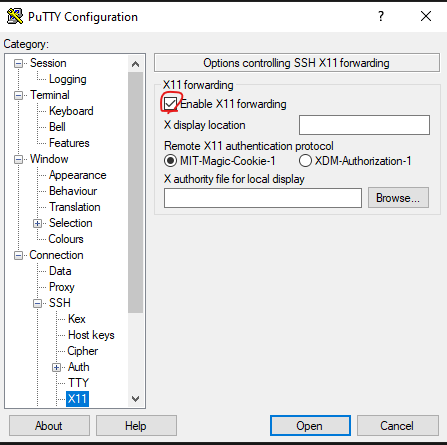
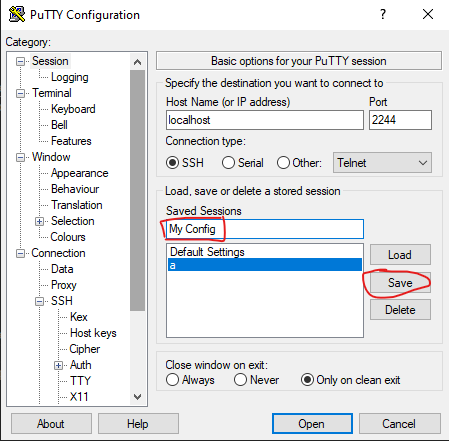
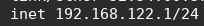

# How to run Linux VM apps as if they were on Windows
This guide assumes your VM network connection is set to NAT

- 1: Install PUTTY on Windows
- 2: [Download](./vmnetcfg.exe) `vmnetcfg.exe`, and place it in the VMware Player installation folder (usually it's `C:\Program Files (x86)\VMware\VMware Player`) 
- 3: Run `vmmnetcfg.exe` **<ins>as administrator</ins>** and:
    - Select "VMNET8" and click on "NAT Settings":

    

    - Click "Add..."

    

    - Set the connection settings. In this case:
        - Host Port: Let's use `22`
        - Virtual Machine IP Address: The VM's IP address. In my case it's `192.168.122.1`, but you need to [check yours](#how-to-check-ip-address-of-the-vm)
        - Virtual Machine Port: Let's use `22`
        - Description: Anything you want

    

- 4: Go to the VM and install openssh by running `sudo apt-get install openssh-server`
- 5: Enable X11 forwarding in `/etc/ssh/ssh_config` by removing the `#` character in the line saying "ForwardX11 yes", so that it looks like this:

    

- 6: Restart the VM

Now, on Windows:
- 1: Install [Xming X Server for Windows](https://sourceforge.net/projects/xming/) and use the [config.xlaunch](./config.xlaunch) file to launch it.
    - Tip: Place the file on the Startup folder of Windows (Win+R -> `shell:startup`) so it starts in the background everytime you log in
- 2: Configure PUTTY:
    - Set the connection settings by:
        - Host: localhost
        - Port: 2244

        

    - Enable X11 Forwarding:
    
    

    - Save the configuration by giving it a name and pressing Save:

    

- 3: Try the connection by pressing Open. If it works, we're good to go!

You can now also create a shortcut on your desktop to make it easier to launch the PUTTY session.

Create a shortcut with this path, and replace the relevant params:

`"C:\Program Files\PuTTY\putty.exe" -load {CONFIG_NAME} -pw {YOUR_USER_PASSWORD} -t`

So for example:

`"C:\Program Files\PuTTY\putty.exe" -load MyConfigName -pw MySuperSecurePassword -t`

# Common Issues
### Cursor too big
If the mouse cursor looks too big, set the cursor size environment variable like this:

`export XCURSOR_SIZE=16`

# How to check IP address of the VM
- 1: Execute the `ip addr` command
- 2: IP should be located in the `virbr0` entry, like so:

